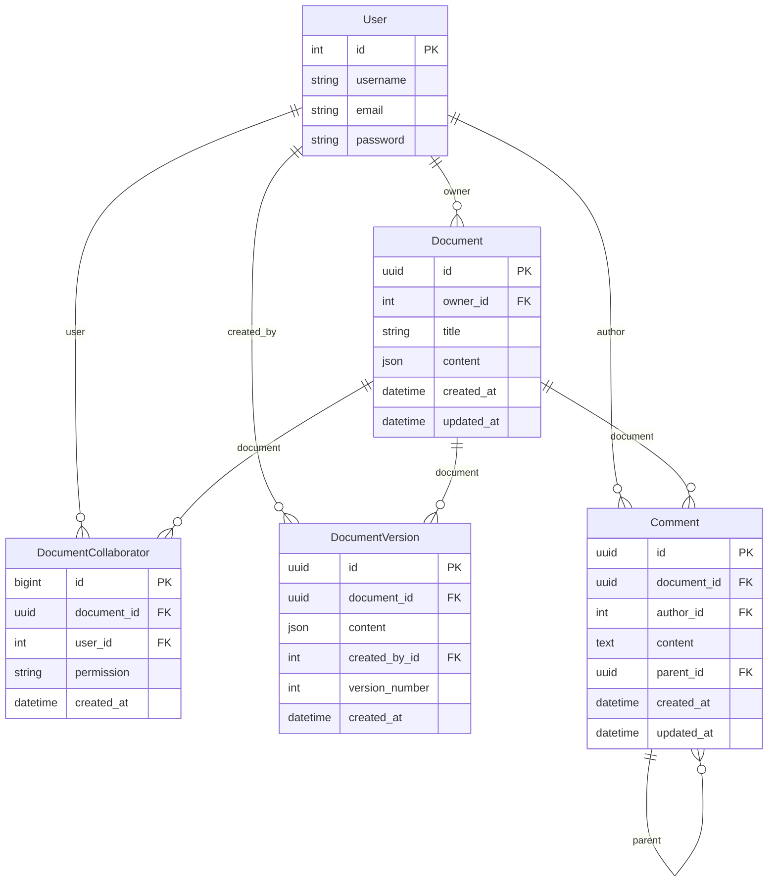

# SyncDocs 架構設計文檔

> 本文檔詳細說明 SyncDocs 的系統架構、設計決策和技術選型。適合想深入理解系統設計的學習者。

---

## 目錄

- [系統概覽](#系統概覽)
- [技術架構](#技術架構)
- [數據流向](#數據流向)
- [核心模組設計](#核心模組設計)
- [設計模式](#設計模式)
- [技術選型理由](#技術選型理由)
- [安全性設計](#安全性設計)
- [效能考量](#效能考量)
- [擴展性設計](#擴展性設計)
- [延伸閱讀](#延伸閱讀)

---

## 系統概覽

### 專案定位

SyncDocs 是一個**教學型**的即時協作文件編輯器，展示了現代全端開發的核心技術：
- 前後端分離
- RESTful API 設計
- WebSocket 即時通訊
- 富文本編輯
- 多用戶協作

### 核心功能

```
┌─────────────────────────────────────────────────────────┐
│                    SyncDocs 功能架構                      │
├─────────────────────────────────────────────────────────┤
│  1. 用戶管理      │ 註冊、登入、JWT 認證                    │
│  2. 文件管理      │ CRUD、分享、權限控制                    │
│  3. 富文本編輯    │ Quill.js、工具列、格式化                 │
│  4. 即時協作      │ WebSocket、Delta 同步、廣播、游標位置、在線狀態 │
│  5. 自動保存      │ Debounce、狀態管理                     │
│  6. 版本歷史      │ 完整快照、版本列表、還原版本              │
│  7. AI 寫作助手   │ 文字摘要、潤稿、Gemini API              │
│  8. 評論系統      │ 評論、回覆、即時同步、權限控制             │
└─────────────────────────────────────────────────────────┘
```

---

## 技術架構

### 整體架構圖

```
┌─────────────────────────────────────────────────────────────────┐
│                         客戶端層 (Client)                         │
├─────────────────────────────────────────────────────────────────┤
│                                                                   │
│  ┌──────────────┐        ┌──────────────┐                       │
│  │  瀏覽器       │        │  SvelteKit   │                       │
│  │  (Chrome,    │───────▶│  前端應用    │                       │
│  │   Firefox)   │        │  (Port 5173) │                       │
│  └──────────────┘        └───────┬──────┘                       │
│                                   │                               │
└───────────────────────────────────┼───────────────────────────────┘
                                    │
                         ┌──────────┴──────────┐
                         │                     │
                         ▼                     ▼
              ┌──────────────┐      ┌──────────────┐
              │   HTTP API   │      │  WebSocket   │
              │  (REST)      │      │   (WS)       │
              └──────┬───────┘      └──────┬───────┘
                     │                     │
┌────────────────────┼─────────────────────┼───────────────────────┐
│                    │   應用層 (Application)   │                   │
├────────────────────┼─────────────────────┼───────────────────────┤
│                    ▼                     ▼                        │
│  ┌────────────────────┐  ┌────────────────────┐                 │
│  │  Django Ninja API  │  │ Django Channels    │                 │
│  │  - 認證            │  │ - WebSocket        │                 │
│  │  - 文件 CRUD       │  │ - 即時協作         │                 │
│  │  - 協作者管理      │  │ - Channel Layer    │                 │
│  └─────────┬──────────┘  └──────────┬─────────┘                 │
│            │                         │                            │
│            ▼                         ▼                            │
│  ┌────────────────────────────────────────────┐                 │
│  │          Django ORM (資料訪問層)            │                 │
│  └────────────────────┬───────────────────────┘                 │
└───────────────────────┼───────────────────────────────────────────┘
                        │
┌───────────────────────┼───────────────────────────────────────────┐
│                       │     數據層 (Data)                          │
├───────────────────────┼───────────────────────────────────────────┤
│                       ▼                                            │
│         ┌─────────────────────┐        ┌──────────────┐          │
│         │   PostgreSQL        │        │    Redis     │          │
│         │   - 用戶資料        │◀───────│  - Channel   │          │
│         │   - 文件內容        │        │    Layer     │          │
│         │   - 分享關係        │        │  - 連接追蹤  │          │
│         └─────────────────────┘        │  - 速率限制  │          │
│                                         └──────────────┘          │
│                                                                    │
└────────────────────────────────────────────────────────────────────┘
```

### 技術棧一覽

| 層級 | 技術 | 版本 | 用途 |
|------|------|------|------|
| **前端** | Node.js | 24.x | 運行環境 |
| | SvelteKit | 2.x | 全端框架 |
| | Svelte | 5.x | UI 框架 |
| | Vite | 7.x | 開發伺服器 & 打包工具 |
| | TypeScript | 5.x | 型別安全 |
| | Quill.js | 2.x | 富文本編輯器 |
| | Tailwind CSS | 4.x | 樣式框架 |
| | @lucide/svelte | 1.x | 圖標庫 |
| **後端** | Python | 3.13 | 程式語言 |
| | Django | 6.0 | Web 框架 |
| | Django Ninja | 1.6 | API 框架 |
| | Django Channels | 4.x | WebSocket |
| | Google Gen AI | 1.0+ | AI 功能 |
| **數據** | PostgreSQL | 18 | 主資料庫 |
| | Redis | 8-alpine | 快取 & Channel Layer |
| **部署** | Docker | latest | 容器化 |
| | Docker Compose | latest | 編排（override 機制區分開發/生產） |
| | Daphne | 4.x | ASGI 伺服器（生產環境，支援 HTTP + WebSocket） |
| **測試** | pytest | 9.x | 後端測試框架 |
| | Vitest | 3.x | 前端測試框架 |

---

## 數據流向

### 1. 用戶認證流程

```
┌─────────┐                               ┌──────────────┐
│ 瀏覽器  │                               │ Django Ninja │
└────┬────┘                               └──────┬───────┘
     │                                           │
     │  1. POST /api/token/pair                  │
     │     { username, password }                │
     ├──────────────────────────────────────────▶│
     │                                           │
     │                              2. 驗證密碼  │
     │                                 查詢 DB   │
     │                                           │
     │                                    ┌──────┴──────┐
     │                                    │ PostgreSQL  │
     │                                    └──────┬──────┘
     │                                           │
     │                              3. 返回用戶  │
     │                                           │
     │              4. 生成 JWT Token            │
     │                (access + refresh)         │
     │◀──────────────────────────────────────────┤
     │  { access, refresh }                      │
     │                                           │
     │  5. 存儲到 localStorage                   │
     │     └─ access_token                       │
     │                                           │
     │  6. 後續請求攜帶 Token                    │
     │     Header: Authorization: Bearer xxx     │
     ├──────────────────────────────────────────▶│
     │                                           │
```

**關鍵設計點：**
- ✅ 無狀態認證：伺服器不保存 Session
- ✅ Token 過期機制：Access Token 1天，Refresh Token 7天
- ✅ 自動刷新：前端攔截 401 錯誤，先用 Refresh Token 換取新 Access Token 並重試請求，失敗才登出

### 2. 文件編輯流程（HTTP + WebSocket）

```
用戶 A 編輯文件
─────────────────────────────────────────────────────────────

步驟 1: 載入文件 (HTTP)
┌─────────┐                                    ┌──────────────┐
│ 前端 A  │  GET /api/documents/{id}/          │   API        │
├─────────┤  Authorization: Bearer xxx         ├──────────────┤
│         ├───────────────────────────────────▶│ 1. 驗證 JWT  │
│         │                                    │ 2. 檢查權限  │
│         │                                    │ 3. 查詢文件  │
│         │◀───────────────────────────────────┤              │
│         │  { id, title, content, ... }       │              │
│ Quill   │                                    └──────────────┘
│ 渲染    │
└─────────┘

步驟 2: 建立 WebSocket 連接（使用 Subprotocol 認證）
┌─────────┐                                    ┌──────────────┐
│ 前端 A  │  WS /ws/docs/{id}/                 │  Consumer    │
├─────────┤  Subprotocol: access_token.xxx     ├──────────────┤
│         ├───────────────────────────────────▶│ 1. 認證      │
│         │                                    │    (JWT)     │
│         │                                    │ 2. 檢查權限  │
│         │                                    │ 3. 加入群組  │
│         │◀───────────────────────────────────┤    doc_xxx   │
│  連接   │  WebSocket 建立成功                │              │
│  成功   │                                    └──────────────┘
└─────────┘

步驟 3: 即時編輯同步 (WebSocket)
┌─────────┐                                    ┌──────────────┐
│ 前端 A  │                                    │  Consumer A  │
├─────────┤                                    ├──────────────┤
│         │  用戶輸入 "Hello"                  │              │
│ Quill   │  ─▶ text-change 事件               │              │
│ Delta   │  ─▶ {ops: [{insert: "Hello"}]}    │              │
│         │                                    │              │
│         │  發送 Delta                        │              │
│         ├───────────────────────────────────▶│ 1. 接收      │
│         │  {delta: {...}}                    │              │
│         │                                    │ 2. 5層驗證   │
│         │                                    │    (Schema)  │
│         │                                    │ 3. 廣播      │
│         │                                    ├──────────────┤
│         │                                    │ Channel      │
│         │                                    │ Layer        │
│         │                                    │ (Redis)      │
│         │                                    └──────┬───────┘
│         │                                           │
│         │                                    廣播給群組
│         │                                           │
│         │                                    ┌──────▼───────┐
│         │                                    │  Consumer B  │
│         │                                    ├──────────────┤
┌──────────┐                                   │ 1. 接收廣播  │
│ 前端 B   │◀──────────────────────────────────┤ 2. 過濾自己  │
├──────────┤  {delta: {...}}                   │ 3. 轉發前端  │
│ Quill    │                                   └──────────────┘
│ 應用     │
│ Delta    │  ─▶ 更新內容（'silent' 模式）
│          │  ─▶ 用戶 B 看到 "Hello"
└──────────┘

步驟 4: 保存文件 (HTTP)
┌─────────┐                                    ┌──────────────┐
│ 前端 A  │                                    │   API        │
├─────────┤  Debounce 1.5秒後                 ├──────────────┤
│         │  PUT /api/documents/{id}/          │ 1. 更新資料庫│
│         ├───────────────────────────────────▶│ 2. 廣播事件  │
│         │  {title, content}                  │   (Channel)  │
│         │                                    └──────┬───────┘
│         │                                           │
│         │                                           ▼
│         │                                    所有連接的用戶
│         │                                    收到 doc_saved 事件
│         │◀──────────────────────────────────────────┤
│         │  {type: 'doc_saved', updated_at}
│ 更新    │
│ 狀態    │  "All changes saved"
└─────────┘
```

**關鍵設計點：**
- ✅ **雙通道設計**：HTTP 用於持久化，WebSocket 用於即時同步
- ✅ **Echo Prevention**：不將訊息發回原始發送者
- ✅ **Silent Mode**：應用遠端 Delta 時不觸發事件，避免無限循環
- ✅ **Debounce**：減少 API 請求，提升效能

### 3. 協作者管理流程

```
文件所有者分享文件給其他用戶（支援權限級別）
─────────────────────────────────────────────────

┌─────────┐                                    ┌──────────────┐
│ 前端    │  POST /api/documents/{id}/         │   API        │
│ (Owner) │       collaborators/               ├──────────────┤
├─────────┤  {username: "user_b",              │              │
│         │   permission: "write"}             │ 1. 驗證所有權│
│         ├───────────────────────────────────▶│    (owner?)  │
│         │                                    │              │
│         │                                    │ 2. 查找用戶  │
│         │                                    │    User.get  │
│         │                                    │              │
│         │                                    │ 3. 建立協作者│
│         │                                    │ Collaborator │
│         │                                    │   .create()  │
│         │                                    │              │
│         │◀───────────────────────────────────┤ 4. 返回結果  │
│         │  {id, username, email, permission} │              │
│         │                                    └──────────────┘
│  更新   │
│  列表   │
└─────────┘

權限級別說明：
  - write（編輯）：可讀取、編輯、WebSocket 發送 delta
  - read（只讀）：可讀取、WebSocket 接收 delta，但不能編輯

用戶 B（編輯權限 write）可以：
  ✅ GET /api/documents/{id}/    (讀取文件)
  ✅ PUT /api/documents/{id}/    (編輯文件)
  ✅ WebSocket 連接 + 發送       (即時協作)
  ❌ DELETE /api/documents/{id}/ (不能刪除)
  ❌ 管理協作者                   (不能添加/移除)

用戶 C（只讀權限 read）可以：
  ✅ GET /api/documents/{id}/    (讀取文件)
  ❌ PUT /api/documents/{id}/    (403 Forbidden)
  ✅ WebSocket 連接              (即時接收更新)
  ❌ WebSocket 發送 delta        (READ_ONLY 錯誤)
  ❌ DELETE、管理協作者           (不能)
```

**驗證規則：**
- ❌ 擁有者不能將自己添加為協作者（HTTP 400 錯誤）
- ❌ permission 必須是 'read' 或 'write'（HTTP 400 錯誤）

### 4. AI 寫作助手流程

```
用戶在編輯器中選取文字，選擇「摘要」或「潤稿」
─────────────────────────────────────────────────

┌─────────┐                                    ┌──────────────┐
│ 前端    │  POST /api/ai/process              │  AIController│
│ AI      │  {action: "summarize"|"polish",    ├──────────────┤
│ Dialog  │   text: "選取的文字"}              │              │
├─────────┤                                    │ 1. JWT 認證  │
│         ├───────────────────────────────────▶│              │
│ 30s     │                                    │ 2. 速率限制  │
│ 超時    │                                    │   (Redis)    │
│ 控制    │                                    │              │
│         │                                    └──────┬───────┘
│         │                                           │
│         │                                    ┌──────▼───────┐
│         │                                    │  AIService   │
│         │                                    ├──────────────┤
│         │                                    │ 1. 截斷輸入  │
│         │                                    │   (≤5000字元)│
│         │                                    │ 2. 組合 Prompt│
│         │                                    │ 3. 呼叫 API  │
│         │                                    └──────┬───────┘
│         │                                           │
│         │                                    ┌──────▼───────┐
│         │                                    │ Gemini API   │
│         │                                    │ (Google)     │
│         │                                    └──────┬───────┘
│         │                                           │
│         │◀──────────────────────────────────────────┤
│         │  {success, result, action}                │
│ 顯示   │
│ 結果   │
└─────────┘
```

**架構要點：**

| 層級 | 檔案 | 職責 |
|------|------|------|
| API | `ai_api.py` | 認證、速率限制檢查、回應格式 |
| 服務 | `ai_service.py` | Prompt 組合、Gemini 呼叫、錯誤處理 |
| 速率限制 | `ai_rate_limiter.py` | Redis Sorted Set 滑動窗口 |

**速率限制：** 每用戶 10 次/60 秒，使用 Redis Sorted Set（與 WebSocket 速率限制相同演算法）。AI 速率限制採 fail-open（錯誤時放行），與 WebSocket 連接管理的 fail-closed 策略不同，因為 AI 請求不涉及持續資源佔用。

**Gemini Client：** 延遲初始化（lazy init），避免模組載入時 Django settings 未就緒。全域單例，不重複建立連線。

---

## 核心模組設計

### 後端模組架構

```
backend/
├── backend/                    # 專案配置
│   ├── settings.py            # Django 設定（DB, CORS, JWT, Channel Layer）
│   ├── urls.py                # URL 路由
│   ├── asgi.py                # ASGI 入口（WebSocket）
│   └── wsgi.py                # WSGI 入口（HTTP）
│
└── docs_app/                   # 核心應用
    ├── models.py              # 資料模型（Document, Collaborator, Version, Comment）
    ├── api.py                 # 文件 CRUD API
    ├── auth_api.py            # 認證 API（註冊、登入、Token）
    ├── ai_api.py              # AI API（摘要、潤稿）
    ├── comment_api.py         # 評論 API
    ├── ai_service.py          # AI 服務層（Gemini 整合）
    ├── redis_pool.py          # 統一 Redis 連接池管理
    ├── ai_rate_limiter.py     # AI 速率限制
    ├── consumers.py           # WebSocket 消費者
    ├── schemas.py             # Pydantic Schema
    ├── routing.py             # WebSocket 路由
    ├── auth_middleware.py     # WebSocket 認證中間件
    ├── connection_manager.py  # WebSocket 連接管理
    ├── rate_limiter.py        # 消息速率限制
    ├── pagination.py          # 分頁工具
    ├── management/commands/   # 管理指令
    │   └── clear_ws_connections.py  # Redis 連線清理
    └── tests/                 # 測試（pytest）
```

### 前端模組架構

```
frontend/src/
├── routes/                     # 頁面路由
│   ├── +layout.svelte         # 全局佈局
│   ├── +page.svelte           # 首頁
│   ├── login/                 # 登入頁
│   ├── register/              # 註冊頁
│   └── (protected)/           # 需認證的路由群組
│       ├── dashboard/         # 文件列表頁
│       └── docs/[document_id]/ # 文件編輯頁（Quill + WebSocket）
│
└── lib/                        # 共享模組
    ├── auth.ts                # 認證工具（API 封裝、Token 管理）
    ├── ai.ts                  # AI API 模組
    ├── toast.ts               # Toast 通知工具
    ├── api/                   # API 模組
    │   ├── documents.ts       # 文件 API
    │   ├── versions.ts        # 版本歷史 API
    │   └── comments.ts        # 評論 API
    ├── components/            # 可複用組件
    │   ├── QuillEditor.svelte # Quill 編輯器
    │   ├── AIDialog.svelte    # AI 寫作助手對話框
    │   ├── ConfirmDialog.svelte # 統一確認對話框（取代原生 confirm）
    │   ├── VersionHistoryPanel.svelte  # 版本歷史面板
    │   └── CommentPanel.svelte # 評論面板
    └── types/                 # TypeScript 類型定義
        ├── cursor.ts          # Cursor / Presence 型別
        └── quill.ts           # Quill / Delta 型別
```

### 數據模型設計

#### Document 模型

```python
class Document(models.Model):
    # ─────────── 主鍵 ───────────
    id = UUIDField(primary_key=True, default=uuid4)
    # 設計理由：
    # ✓ UUID 不可預測，增加安全性
    # ✓ 分散式系統友善，不會衝突
    # ✓ 不洩漏系統資訊（如文件總數）

    # ─────────── 基本資訊 ───────────
    title = CharField(max_length=255)
    content = JSONField(default=dict)
    # 設計理由：
    # ✓ JSONField 直接儲存 Quill Delta
    # ✓ 避免 HTML XSS 風險
    # ✓ 結構化資料，易於處理

    # ─────────── 所有權 ───────────
    owner = ForeignKey(User, on_delete=CASCADE, related_name='owned_documents')
    # 設計理由：
    # ✓ 明確的所有權關係
    # ✓ CASCADE：用戶刪除時，文件也刪除
    # ✓ related_name：反向查詢用戶擁有的文件

    # ─────────── 協作關係 ───────────
    # 透過 DocumentCollaborator 中間模型管理（支援 read/write 權限）
    # 設計理由：
    # ✓ 中間模型支援權限級別（只讀/編輯）
    # ✓ 可擴展：未來可添加 invited_by、expires_at 等欄位
    # ✓ 審計追蹤：記錄協作關係創建時間

    # ─────────── 時間戳 ───────────
    created_at = DateTimeField(auto_now_add=True)
    updated_at = DateTimeField(auto_now=True)
    # 設計理由：
    # ✓ 自動管理，無需手動設置
    # ✓ 用於排序和顯示

    # ─────────── 元數據 ───────────
    class Meta:
        ordering = ['-updated_at']  # 最近編輯的在前
        indexes = [
            Index(fields=['owner', '-updated_at']),  # GET /api/documents/ 用戶文件列表
            Index(fields=['-created_at']),           # 按創建時間排序的全局查詢
        ]
```

**資料庫關係圖：**



**關係說明：**
- `||--o{` 表示一對多 (1:N) 關係
- User ↔ Document 的多對多 (M:N) 協作關係透過 `DocumentCollaborator` 中間模型實現

#### PermissionLevel 權限枚舉

```python
class PermissionLevel(models.TextChoices):
    """
    權限級別選項
    定義協作者對文檔的訪問權限級別
    """
    READ = 'read', '只讀'   # 只能查看文件內容
    WRITE = 'write', '編輯' # 可以編輯文件內容
```

**設計理由：**
- 使用 `TextChoices` 提供類型安全和可讀性
- 目前支援兩種權限級別，未來可擴展（如 `ADMIN`、`COMMENT_ONLY`）
- 預設權限為 `WRITE`，因為分享通常是為了協作編輯

#### DocumentCollaborator 模型（顯式中間模型）

```python
class DocumentCollaborator(models.Model):
    # ─────────── 主鍵 ───────────
    # 使用 Django 默認 BigAutoField（非 UUID）
    # 設計理由：
    # ✓ 中間模型不需要分散式 ID
    # ✓ BigAutoField 查詢效能較好
    # ✓ 不會直接暴露給 API（通過 document/user 查詢）

    # ─────────── 關聯 ───────────
    document = ForeignKey(Document, on_delete=CASCADE, related_name='collaborators')
    user = ForeignKey(User, on_delete=CASCADE, related_name='document_collaborations')
    # 設計理由：
    # ✓ 雙向 CASCADE：文檔/用戶刪除時，協作關係也刪除
    # ✓ UniqueConstraint 確保同一用戶只能有一筆協作記錄

    # ─────────── 權限 ───────────
    permission = CharField(choices=PermissionLevel.choices, default=PermissionLevel.WRITE)
    # 設計理由：
    # ✓ 這是使用顯式中間模型的主因
    # ✓ 支援 read（只讀）和 write（編輯）兩種權限
    # ✓ 可擴展：未來可加 'admin', 'comment_only' 等

    # ─────────── 時間戳 ───────────
    created_at = DateTimeField(auto_now_add=True)

    # ─────────── 元數據 ───────────
    class Meta:
        constraints = [
            UniqueConstraint(fields=['document', 'user'], name='unique_document_user'),
        ]
        indexes = [
            Index(fields=['document', 'user']),  # 權限檢查：can_user_access(), can_user_write()
            Index(fields=['user']),               # 用戶協作列表：GET /api/documents/ 過濾
        ]
```

**為何使用顯式中間模型而非簡單 ManyToMany？**

```python
# ❌ 簡單 ManyToMany（無法存儲權限）
class Document(models.Model):
    collaborators = models.ManyToManyField(User, related_name='shared_documents')

# ✅ 顯式中間模型（可存儲額外屬性）
class Document(models.Model):
    # 透過 DocumentCollaborator 中間模型管理
    pass

class DocumentCollaborator(models.Model):
    document = ForeignKey(Document, ...)
    user = ForeignKey(User, ...)
    permission = CharField(...)  # ← 這是關鍵
```

#### DocumentVersion 模型

```python
class DocumentVersion(models.Model):
    # ─────────── 主鍵 ───────────
    id = UUIDField(primary_key=True, default=uuid4)

    # ─────────── 關聯文件 ───────────
    document = ForeignKey(Document, on_delete=CASCADE, related_name='versions')
    # 設計理由：
    # ✓ CASCADE：文件刪除時，版本也刪除
    # ✓ related_name：可用 document.versions 查詢版本列表

    # ─────────── 版本內容 ───────────
    content = JSONField(default=dict)  # 完整 Quill Delta 快照
    # 設計理由：
    # ✓ 完整快照方案：實作簡單、還原直接
    # ✓ 每次保存都創建完整副本
    # ✓ 版本上限 50 個，自動清理舊版本

    # ─────────── 創建者 ───────────
    created_by = ForeignKey(User, on_delete=SET_NULL, null=True)
    # 設計理由：
    # ✓ SET_NULL：用戶刪除後保留版本記錄
    # ✓ 審計追蹤：知道誰創建了版本

    # ─────────── 版本號 ───────────
    version_number = PositiveIntegerField()
    # 設計理由：
    # ✓ 遞增版本號，方便用戶識別
    # ✓ UniqueConstraint 確保唯一性

    # ─────────── 時間戳 ───────────
    created_at = DateTimeField(auto_now_add=True)

    # ─────────── 元數據 ───────────
    class Meta:
        ordering = ['-version_number']
        constraints = [
            UniqueConstraint(fields=['document', 'version_number'], name='unique_document_version'),
        ]
        indexes = [
            Index(fields=['document', '-version_number']),  # GET /api/documents/{id}/versions/ 版本列表
        ]
```

#### Comment 模型

```python
class Comment(models.Model):
    # ─────────── 主鍵 ───────────
    id = UUIDField(primary_key=True, default=uuid4)

    # ─────────── 關聯文件 ───────────
    document = ForeignKey(Document, on_delete=CASCADE, related_name='comments')
    # 設計理由：
    # ✓ CASCADE：文件刪除時，評論也刪除
    # ✓ related_name：可用 document.comments 查詢評論列表

    # ─────────── 評論作者 ───────────
    author = ForeignKey(User, on_delete=CASCADE, related_name='comments')

    # ─────────── 評論內容 ───────────
    content = TextField()

    # ─────────── 回覆功能 ───────────
    parent = ForeignKey('self', on_delete=CASCADE, null=True, blank=True, related_name='replies')
    # 設計理由：
    # ✓ 自引用：支援評論回覆（討論串）
    # ✓ CASCADE：父評論刪除時，回覆也刪除

    # ─────────── 時間戳 ───────────
    created_at = DateTimeField(auto_now_add=True)
    updated_at = DateTimeField(auto_now=True)

    # ─────────── 元數據 ───────────
    class Meta:
        ordering = ['created_at']
        indexes = [
            Index(fields=['document', 'created_at']),  # GET /api/documents/{id}/comments/ 評論列表
            Index(fields=['parent']),                   # 子回覆查詢
        ]
```

---

## 設計模式

### 1. Repository Pattern（倉儲模式）

雖然本專案未完全實現，但權限檢查方法體現了這個概念：

```python
class DocumentController:
    def _get_user_accessible_documents_query(self, user):
        """統一的查詢邏輯"""
        return Q(owner=user) | Q(collaborators__user=user)

    def _get_document_with_permission_check(self, document_id, user, owner_only=False):
        """統一的權限檢查邏輯"""
        # 集中管理資料訪問和權限
```

**優點：**
- ✅ 單一真相來源
- ✅ 易於測試
- ✅ 易於維護

### 2. Middleware Pattern（中間件模式）

```python
# WebSocket 認證中間件
class JWTAuthMiddleware:
    def __init__(self, app):
        self.app = app

    async def __call__(self, scope, receive, send):
        # 1. 預處理：認證
        token = extract_token_from_query(scope)
        scope['user'] = await authenticate(token)

        # 2. 調用下一層
        return await self.app(scope, receive, send)
```

**應用場景：**
- 認證/授權
- 日誌記錄
- CORS 處理
- 錯誤處理

### 3. Observer Pattern（觀察者模式）

Channel Layer 實現了觀察者模式：

```python
# 發布者
await self.channel_layer.group_send(
    'doc_123',  # 主題
    {'type': 'doc_update', 'delta': {...}}  # 事件
)

# 訂閱者
async def doc_update(self, event):
    # 收到通知，處理事件
    await self.send(...)
```

**優點：**
- ✅ 鬆耦合
- ✅ 多對多通知
- ✅ 易於擴展

### 4. Strategy Pattern（策略模式）

Quill 的 `source` 參數體現了策略模式：

```typescript
editor.updateContents(delta, 'user');    // 用戶輸入策略
editor.updateContents(delta, 'api');     // API 更新策略
editor.updateContents(delta, 'silent');  // 靜默策略
```

不同的 `source` 觸發不同的行為（事件處理）。

### 5. Facade Pattern（外觀模式）

前端的 `auth.ts` 提供了統一的 API 介面：

```typescript
// 外觀：簡化的 API
export async function get(url: string) {
    const token = getToken();
    const response = await fetch(url, {
        headers: { Authorization: `Bearer ${token}` }
    });
    return handleResponse(response);
}

// 使用者不需要關心：
// - Token 從哪裡來
// - 如何設置 Header
// - 如何處理錯誤
```

---

## 技術選型理由

### Quill.js vs 其他編輯器

**為什麼選擇 Quill？**

| 特性 | Quill | TinyMCE (部分付費) | Tiptap (部分付費) |
|------|-------|---------|----------|
| Delta 模型 | 原生支援 | 不支援 | 不支援 |
| 即時協作 | 適合 | 需付費功能 | 基於 Yjs（完整功能需付費） |
| API 簡潔度 | 簡潔 | 中等 | 靈活但較複雜 |
| 文檔品質 | 良好 | 良好 | 良好 |
| 學習曲線 | 平緩 | 中等 | 中等偏高 |
| 維護狀態 | 較慢 | 活躍 | 活躍 |

**決策關鍵：**
- Delta 模型是教學重點，Quill 原生支援 Delta 格式
- 雖然 Quill 的維護速度較慢，但為了學習 Delta 概念而選用
- API 友善，易於整合

### PostgreSQL vs MySQL

選擇 PostgreSQL，主要因為原生 JSONField 支援，適合儲存 Quill Delta 的 JSON 格式內容。

### Redis vs In-Memory

**為什麼選擇 Redis？**

```python
# In-Memory Channel Layer（僅開發環境）
CHANNEL_LAYERS = {
    "default": {
        "BACKEND": "channels.layers.InMemoryChannelLayer"
    }
}
# ❌ 問題：不支援多伺服器實例

# Redis Channel Layer（生產環境）
CHANNEL_LAYERS = {
    "default": {
        "BACKEND": "channels_redis.core.RedisChannelLayer",
        # ...
    }
}
# ✅ 優勢：支援水平擴展
```

---

## 安全性設計

### 1. 認證安全

```python
# JWT Token 配置
NINJA_JWT = {
    'ACCESS_TOKEN_LIFETIME': timedelta(days=1),      # 短期有效
    'REFRESH_TOKEN_LIFETIME': timedelta(days=7),     # 長期有效
    'SIGNING_KEY': SECRET_KEY,                        # 簽名密鑰
}
```

**安全措施：**
- ✅ Token 簽名防篡改
- ✅ 過期時間限制
- ✅ Refresh Token 輪換機制
- ✅ Access Token 自動刷新：`apiFetch` 遇到 401 時自動用 Refresh Token 換取新 Access Token 並重試
- ✅ 併發刷新鎖：使用 `refreshPromise` 防止多個請求同時觸發刷新
- ✅ WebSocket 使用 Subprotocol 傳遞 Token（不在 URL 中）

### 2. 權限控制

**三層防護：**

```python
# 1. 裝飾器級別
@api_controller("/documents", tags=["documents"], auth=JWTAuth(), permissions=[IsAuthenticated])

# 2. 方法級別
def _get_document_with_permission_check(self, document_id, user, require_write=False, owner_only=False):
    # 檢查是否 owner 或 collaborator

# 3. 查詢級別
Q(owner=user) | Q(collaborators__user=user)  # 資料庫層面過濾
```

### 3. XSS 防護

```python
# ✅ 使用 JSONField 儲存 Delta，不儲存 HTML
content = models.JSONField(default=dict)

# ❌ 如果儲存 HTML
content = models.TextField()  # 風險：<script>alert('xss')</script>
```

### 4. CSRF 防護

```python
# Django 內建 CSRF 中間件
MIDDLEWARE = [
    'django.middleware.csrf.CsrfViewMiddleware',
    # ...
]

# API 使用 JWT，不需要 CSRF Token
```

### 5. SQL 注入防護

```python
# ✅ 使用 ORM，自動防護
Document.objects.filter(owner=user)

# ❌ 原始 SQL（教學項目不使用）
cursor.execute(f"SELECT * FROM document WHERE owner={user.id}")  # 危險！
```

### 6. WebSocket 安全機制

**認證失敗處理：**
- ✅ 連接失敗時發送具體錯誤原因（type: connection_error）
- ✅ 使用 WebSocket Close Codes (4001-4009)
- ✅ 支持多種錯誤類型：TOKEN_EXPIRED、PERMISSION_DENIED、DOCUMENT_NOT_FOUND、READ_ONLY_VIOLATION 等
- ✅ TOKEN_EXPIRED 時自動用 Refresh Token 換取新 Access Token 後重連，而非直接登出

**前端自動重連機制：**
- ✅ 指數退避 + 隨機抖動（1s → 2s → 4s...上限 30s）
- ✅ 最多重連 5 次，超過後提示用戶刷新頁面
- ✅ 永久性錯誤（4001-4009）和正常關閉（1000/1001）不觸發重連
- ✅ 重連前清理舊 socket 防止連線洩漏
- ✅ 重連成功顯示 Connection restored 提示

**連接數量限制：**
```python
# 每用戶最多 5 個並發 WebSocket 連接（可配置）
WEBSOCKET_MAX_CONNECTIONS_PER_USER = 5
```
- ✅ 使用 Redis SET 追蹤活躍連接
- ✅ Lua 腳本確保原子性操作
- ✅ 防止單一用戶資源耗盡

**連接生命週期管理：**
```python
# 連接 TTL（秒）- 防止連線殘留
WEBSOCKET_CONNECTION_TTL = 300  # 5 分鐘

# 心跳間隔（秒）- 刷新活躍連線與 Presence TTL
WEBSOCKET_HEARTBEAT_INTERVAL = 120  # 2 分鐘
```
- ✅ 自動過期：連線記錄 5 分鐘後自動清除
- ✅ 心跳刷新：活躍連線每 2 分鐘刷新連線與 Presence TTL
- ✅ Fail-Closed：Redis 錯誤時拒絕新連線（安全優先）
- ✅ 重試機制：移除連線時最多重試 3 次（指數退避）

**消息速率限制：**
```python
# 滑動窗口算法：每 10 秒最多 30 條消息
WEBSOCKET_RATE_LIMIT_MESSAGES = 30
WEBSOCKET_RATE_LIMIT_WINDOW = 10
```
- ✅ 使用 Redis Sorted Set 實現滑動窗口
- ✅ 返回 retry_after 提示客戶端等待時間
- ✅ 防止惡意客戶端濫發消息

**消息驗證：**
- ✅ 消息大小限制（256KB）
- ✅ Pydantic Schema 驗證 Delta 格式
- ✅ 操作數量限制（1000 個 ops）

---

## 效能考量

### 1. 資料庫查詢優化

```python
# ❌ N+1 查詢問題
documents = Document.objects.all()
for doc in documents:
    print(doc.owner.username)  # 每次都查詢資料庫！

# ✅ 使用 select_related（ForeignKey 關係）
documents = Document.objects.select_related('owner').all()
# 只執行一次 JOIN 查詢

# ✅ 使用 prefetch_related（反向關係/ManyToMany）
documents = Document.objects.prefetch_related('collaborators').all()
# 執行兩次查詢，但總體更高效
```

**已實現的優化：**
```python
# api.py
documents = Document.objects.select_related('owner').filter(query).distinct()
```

### 2. 前端效能優化

**Debounce 自動保存：**
```typescript
const debouncedSave = () => {
    clearTimeout(debounceTimeout);
    debounceTimeout = setTimeout(async () => {
        await put(`/documents/${documentId}/`, { title, content });
    }, 1500);  // 1.5 秒後才保存
};
```

**效果：**
- ❌ 無 Debounce：每次按鍵都發送請求（可能數百次）
- ✅ 有 Debounce：停止輸入 1.5 秒後才發送（僅 1 次）

### 3. WebSocket 訊息優化

#### 後端：避免 Echo（回聲）

```python
async def doc_update(self, event):
    sender_channel = event.get('sender_channel')
    if self.channel_name != sender_channel:  # 不發回原始發送者
        await self.send(...)
```

**節省：**
- 50% 的網路流量（雙向 → 單向）
- 避免無限循環

#### 前端：Throttle 機制

```typescript
// 使用 throttle 控制 WebSocket 發送頻率
const THROTTLE_INTERVAL = 150; // ms

// 累積 delta 並合併
if (pendingDelta) {
    pendingDelta = { ops: d1.compose(d2).ops };
}
```

**配合設計：**

| 層級 | 機制 | 配置 | 效果 |
|------|------|------|------|
| 前端 | Throttle | 150ms 間隔 | ~7 條/秒 |
| 後端 | 滑動窗口 | 30 條/10 秒 | 防止濫用 |

**Throttle vs Debounce：**

| 機制 | 用途 | 延遲 |
|------|------|------|
| Throttle | WebSocket 即時同步 | 最大 150ms |
| Debounce | HTTP API 儲存 | 1.5 秒 |

### 4. 索引優化

```python
class Meta:
    indexes = [
        Index(fields=['owner', '-updated_at']),  # 複合索引
        Index(fields=['-created_at']),
    ]
```

**查詢加速：**
- 文件列表頁：`O(log n)` vs `O(n)`
- 特別是大量文件時效果顯著

### 5. Redis 使用策略

**統一連接池（`redis_pool.py`）：**
所有需要 Redis 連線的模組（`consumers.py`、`connection_manager.py`、`rate_limiter.py`、`ai_rate_limiter.py`）統一透過 `redis_pool.py` 取得共用連線，避免各自建立獨立的連線池。提供 `get_async_redis()`（async 場景）和 `get_sync_redis()`（sync 場景）兩個入口。

**Channel Layer（WebSocket 廣播）：**
```python
CHANNEL_LAYERS = {
    "default": {
        "BACKEND": "channels_redis.core.RedisChannelLayer",
        "CONFIG": {"hosts": [(REDIS_HOST, REDIS_PORT)]},
    }
}
```

**連接追蹤（SET + TTL）：**
```
Key: ws:connections:user:{user_id}
Type: SET
Members: [channel_name_1, channel_name_2, ...]
TTL: 300 秒（5 分鐘）
```
- Lua 腳本確保原子性（檢查 + 添加在同一操作）
- 心跳刷新連線與 Presence TTL，防止活躍連線被誤清除
- 異常斷線時由 TTL 自動清理（無需手動清除）

**速率限制（Sorted Set）：**
```
Key: ws:ratelimit:user:{user_id}:doc:{document_id}
Type: SORTED SET
Score: timestamp
```
- 滑動窗口算法，無需定期清理
- 自動過期機制（窗口 × 2）

---

## 擴展性設計

本專案的架構設計考量了未來擴展的可能性：

| 設計決策 | 擴展潛力 |
|---------|---------|
| **無狀態 API（JWT）** | 可水平擴展，支援負載均衡 |
| **Redis Channel Layer** | 支援多伺服器實例間的 WebSocket 通訊 |
| **PostgreSQL JSONField** | 靈活的資料結構，易於擴展欄位 |
| **模組化設計** | 易於新增 API 端點和 WebSocket 事件類型 |

> 💡 **注意**：作為教學專案，這些擴展能力未實際實現，但設計上預留了空間。

---

## 延伸閱讀

- [Django 官方文檔](https://docs.djangoproject.com/)
- [Django Ninja 文檔](https://django-ninja.rest-framework.com/)
- [SvelteKit 文檔](https://kit.svelte.dev/)
- [Quill Delta 規範](https://quilljs.com/docs/delta/)
- [Django Channels 文檔](https://channels.readthedocs.io/)
- [WebSocket RFC](https://tools.ietf.org/html/rfc6455)
- [JWT 標準](https://tools.ietf.org/html/rfc7519)
- [RESTful API 設計指南](https://restfulapi.net/)

---

**本文檔持續更新中。如有問題或建議，歡迎提 Issue！** 🚀
