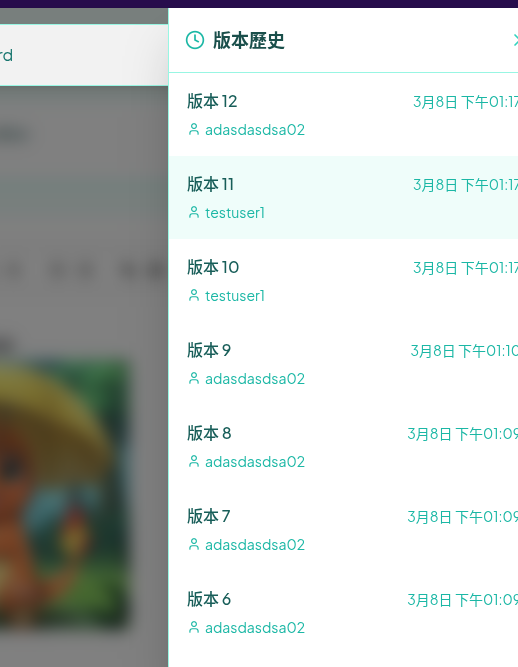
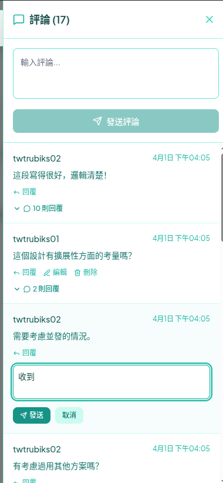

# SyncDocs - Real-time Collaborative Document Editor

[中文版](README.md)

SyncDocs is a web-based collaborative document editor inspired by Google Docs, built with a modern technology stack. It allows users to create, edit, and share documents with others in real-time.

This project leverages Django Ninja for a high-performance backend API and SvelteKit for a reactive and fast frontend user interface.

~~This project was completed with assistance from [Cline](https://github.com/twtrubiks/mcp-vscode-cline?tab=readme-ov-file#cline). For reference, see [.clinerules/MVP_Development.md](.clinerules/MVP_Development.md)~~

Subsequent development was implemented using Claude Code

## Screenshots


*Real-time Updates*


*Document Sharing*


*Presence Indicators and Cursor Position Display*


*Text Summarization and Polishing*


*Version History*



*Comment System*



## ✨ Key Features

  * **Real-time Collaboration**: Multiple users can edit the same document simultaneously, with changes reflected instantly for all participants, powered by Django Channels.
  * **Cursor Position Display**: Real-time display of collaborators' cursor positions and selections, using the quill-cursors package.
  * **Presence Indicators**: Show which users are currently viewing or editing the document, including usernames and colors.
  * **Rich Text Editing**: A clean and intuitive editor based on [Core Architecture of the Quill.js Delta Format](Delta_en.md), supporting various formatting options.
  * **AI Writing Assistant**: Integrated with Google Gemini API, providing text summarization and polishing features to enhance writing efficiency.
  * **Version History**: Automatically saves document versions, allowing users to view history and restore to previous versions.
  * **Comment System**: Add comments and replies to documents, with real-time synchronization for all collaborators.
  * **User Authentication**: Secure user registration and login system.
  * **Document Management**: Users can create, view, and manage their documents from a personal dashboard.
  * **Document Sharing**: Easily share documents with other users for collaboration.
  * **Fast & Modern Tech Stack**: Utilizes Django Ninja for the backend API and SvelteKit for the frontend, ensuring high performance and a modern development experience.

## 🛠️ Tech Stack

### Backend

  * **Framework**: [Django](https://github.com/twtrubiks/django-tutorial) with [Django Ninja](https://github.com/twtrubiks/django_ninja_tutorial) for building REST APIs
  * **Real-time Communication**: [Django Channels](https://github.com/twtrubiks/django-chat-room) for handling WebSockets
  * **Database**: PostgreSQL (default in Docker environment)
  * **Async Server**: Uvicorn/Daphne
  * **Dependencies**:
      * `django`
      * `django-ninja`
      * `channels`
      * `channels-redis`
      * `google-genai` (AI features)

### Frontend

  * **Framework**: [SvelteKit](https://kit.svelte.dev/)
  * **Language**: TypeScript
  * **Rich Text Editor**: [Quill.js](https://quilljs.com/)
  * **Styling**: Tailwind CSS

## 📂 Project Structure

The project is primarily divided into two directories:

```plaintext
.
├── backend/      # Contains the Django project
│   ├── docs_app/ # The core Django app for handling documents and users
│   └── backend/  # Django project configuration
└── frontend/     # Contains the SvelteKit project
    ├── src/
    │   ├── routes/ # SvelteKit's file-based routing
    │   └── lib/    # Svelte components and utility functions
```

## 🚀 Local Development Setup

Follow these steps to set up and run the project on your local machine.

### Prerequisites

  * [Python](https://www.python.org/downloads/) 3.12+
  * [Node.js](https://nodejs.org/) 18+ and npm (or pnpm/yarn)
  * [Redis](https://redis.io/docs/getting-started/installation/) (for the real-time collaboration feature)

### Environment Variables Setup

Before starting, please copy the environment variable templates:

```bash
# Root directory (used by Docker Compose)
cp .env.example .env

# Frontend (used by SvelteKit, required for both Docker and local development)
cp frontend/.env.example frontend/.env
```

> **Note**: `.env` files contain sensitive information and are included in `.gitignore`, so they won't be committed to version control.

### Quick Start (Using Docker, Recommended)

```bash
docker compose up --build
```

**Docker Environment Variables:**
* Root `.env` → Read by Docker Compose → Injected into backend container
* `frontend/.env` → Mounted to container → Read directly by SvelteKit

### Local Development (Without Docker)

> **⚠️ Note**: Local development requires you to install and start PostgreSQL and Redis services yourself.

## 1. Backend Setup

```bash
# Navigate to the backend directory
cd backend

# Create and activate a virtual environment
python -m venv venv
source venv/bin/activate  # On Windows, use `venv\Scripts\activate`

# Install Python dependencies
pip install -r requirements.txt

# Apply database migrations
python manage.py migrate

# Start the Django development server
# The API will be available at http://127.0.0.1:8000
python manage.py runserver
```

**Backend Environment Variables:**

For local development, Django uses default values in `settings.py`:

* Default connection to `django-postgres:5432` (for Docker)
* For local development, modify `POSTGRES_HOST=localhost`

See `backend/.env.example` for available environment variables.

## 2. Frontend Setup

Open a new terminal window.

```bash
# Navigate to the frontend directory
cd frontend

# Copy environment variable template (if not done already)
cp .env.example .env

# Install Node.js dependencies
npm install

# Start the SvelteKit development server
# The frontend will be available at http://localhost:5173
npm run dev -- --open
```

**Frontend Environment Variables:**

`frontend/.env` must exist, as SvelteKit reads this file directly:

```env
PUBLIC_API_URL=http://127.0.0.1:8000
```

* Variables with `PUBLIC_` prefix are exposed to the client
* Restart the development server after modifications

### Accessing the Application

  * **Frontend**: Open your browser and navigate to `http://localhost:5173`.
  * **Backend API Docs**: The auto-generated API documentation is available at `http://127.0.0.1:8000/api/docs`.

### 📖 API Documentation

The backend API is built with Django Ninja, which provides automated, interactive documentation available at [http://127.0.0.1:8000/api/docs](http://127.0.0.1:8000/api/docs).


### Running Tests

Run tests using Docker:

```bash
docker compose --profile testing up
```

Run tests locally:

```bash
pytest --cov=. --cov-report=html
```


## 📚 Learning Resources

As an **educational demonstration project**, this project provides comprehensive learning documentation to help you understand the system design and implementation details:

### Core Documentation

* **[📖 Learning Path Guide (LEARNING_PATH.md)](LEARNING_PATH.md)**
  * 📋 6-stage progressive learning plan
  * 🎯 Checkpoints and hands-on exercises for each stage
  * 💡 Detailed explanations and teaching annotations for key code
  * ⏱️ Estimated learning time: 15-20 days
  * 🎓 Best for: Full-stack beginners, developers wanting to learn real-time collaboration

* **[🏗️ Architecture Design Documentation (ARCHITECTURE.md)](ARCHITECTURE.md)**
  * 🎨 Complete system architecture diagrams and data flow charts
  * 🤔 Technology selection rationale and comparison analysis
  * 🎭 Real-world application of design patterns (Repository, Observer, Middleware...)
  * 🔐 Security design and performance optimization strategies
  * 📊 Architecture Decision Records (ADRs)
  * 🎓 Best for: Intermediate developers, architects, interview preparation

* **[⚙️ Quill.js Delta Core Technology (Delta_en.md)](Delta_en.md)**
  * 🔍 Deep dive into the Delta data model
  * 💡 Why choose Delta over HTML
  * 🤝 How Delta supports real-time collaboration
  * 🎓 Best for: Developers wanting to understand rich text editor principles

### Development Documentation

* **[📋 MVP Development Checklist (.clinerules/MVP_Development.md)](.clinerules/MVP_Development.md)**
  * Complete development phase planning
  * Frontend and backend feature lists

### Recommended Reading Order

1. 🎯 **Beginners**: Delta_en.md → LEARNING_PATH.md (follow the steps)
2. 🏗️ **Experienced Developers**: ARCHITECTURE.md → LEARNING_PATH.md (selective deep dive)
3. 👨‍🏫 **Teachers/Instructors**: ARCHITECTURE.md (course outline) + LEARNING_PATH.md (teaching schedule)

### 🔮 Future Roadmap

This project is an MVP (Minimum Viable Product) with plenty of room for improvement. Here are some potential future features:

  * **Folder Organization**: Implement a folder system for better document management.
  * **Deployment**: Create a production-ready deployment setup using Docker, Gunicorn, and Nginx.
  * **Comprehensive Testing**: Add more unit and end-to-end tests to ensure stability.

## Donation

All articles are original creations resulting from my own research and internalizing the concepts. If you find them helpful and wish to encourage me, you are welcome to buy me a coffee :laughing:

ECPay (No membership required)


[Sponsor Link](http://bit.ly/2F7Jrha)

O'Pay (Membership required)


[Sponsor Link](https://payment.opay.tw/Broadcaster/Donate/9E47FDEF85ABE383A0F5FC6A218606F8)

## List of Sponsors

[List of Sponsors](https://github.com/twtrubiks/Thank-you-for-donate)

## License

MIT license